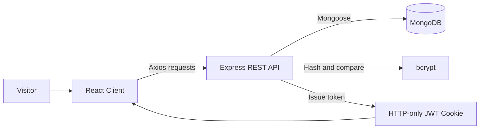

# CodeBuddy — Digital Services Portal

> A responsive full-stack service agency website built with React, Node.js, Express, and MongoDB.

CodeBuddy is a modern web platform for presenting a digital agency's services, portfolio, team, and contact information. It combines an animated, mobile-friendly frontend with a REST API that supports user registration, authentication, logout, password management, and user data retrieval.

This project demonstrates end-to-end MERN development—from reusable React pages and responsive navigation to password hashing, JWT-based authentication, cookies, and MongoDB persistence.

## Highlights

- Responsive multi-page agency website
- Reusable React components and nested client-side routing
- User registration with duplicate-account validation
- Secure password hashing using bcrypt
- JWT authentication delivered through an HTTP-only cookie
- Login, logout, and password-reset workflows
- MongoDB persistence through Mongoose
- Animated sections using AOS and PureCounter
- Responsive Bootstrap-based design
- User listing backed by a REST API
- Clear loading, success, and error states in authentication forms

## Tech Stack

| Layer | Technologies |
| --- | --- |
| Frontend | React 19, React Router, Axios, Bootstrap 5 |
| UI and animation | AOS, Animate.css, Bootstrap Icons, PureCounter |
| Backend | Node.js, Express.js |
| Database | MongoDB, Mongoose |
| Authentication | JSON Web Token, HTTP-only cookies, bcrypt |
| API utilities | CORS, body-parser, cookie-parser |

## Application Flow



The React application runs independently from the Express API. User information is stored in MongoDB, passwords are hashed before persistence, and successful authentication creates a time-limited JWT cookie.

## Pages

| Route | Purpose |
| --- | --- |
| `/` | Landing page with hero carousel and agency overview |
| `/about` | Company introduction and technical skills |
| `/service` | Digital services offered by CodeBuddy |
| `/portfolio` | Portfolio and project showcase |
| `/team` | Team member profiles |
| `/contact` | Contact details, map, and enquiry form |
| `/signup` | New-user registration |
| `/login` | User authentication |
| `/forgot` | Password reset |
| `/signdt` | Registered-user listing |

## REST API

The backend runs on `http://localhost:8000` by default.

| Method | Endpoint | Description |
| --- | --- | --- |
| `POST` | `/signup` | Register a new user |
| `POST` | `/login` | Authenticate a user and create a JWT cookie |
| `POST` | `/logout` | Clear the authentication cookie |
| `POST` | `/forgot-password` | Update a user's password |
| `GET` | `/user` | Retrieve registered users |

Example signup request:

```json
{
  "username": "Alex Johnson",
  "email": "alex@example.com",
  "phone": 9876543210,
  "password": "your-secure-password"
}
```

## Project Structure

```text
ServicePortal/
├── backend/
│   ├── index.js              # Express server, database models, and API routes
│   ├── package.json
│   └── package-lock.json
├── codebuddy/
│   ├── public/
│   │   ├── assets/           # Images, fonts, styles, and vendor libraries
│   │   └── forms/            # Contact form handler
│   ├── src/
│   │   ├── Home.js           # Shared layout, navigation, and hero section
│   │   ├── Header.js         # Main landing-page content
│   │   ├── About.js
│   │   ├── Service.js
│   │   ├── Portfolio.js
│   │   ├── Team.js
│   │   ├── Contact.js
│   │   ├── Login.js
│   │   ├── Signup.js
│   │   ├── Forgot.js
│   │   ├── Signdt.js
│   │   ├── App.css
│   │   └── index.js          # React entry point and route definitions
│   └── package.json
└── README.md
```

## Getting Started

### Prerequisites

- Node.js 18 or later
- npm
- MongoDB Community Server

### 1. Clone the repository

```bash
git clone <your-repository-url>
cd ServicePortal
```

### 2. Configure the backend

```bash
cd backend
npm install
```

Create a `.env` file inside `backend`:

```env
JWT_SECRET=replace_with_a_long_random_secret
```

Ensure MongoDB is running locally. The current development connection is:

```text
mongodb://127.0.0.1:27017/mydata3
```

Start the API:

```bash
node index.js
```

### 3. Start the frontend

Open another terminal:

```bash
cd codebuddy
npm install
npm start
```

Open [http://localhost:3000](http://localhost:3000) in a browser. The API runs on port `8000`.

## Available Frontend Commands

From the `codebuddy` directory:

```bash
npm start       # Start the development server
npm run build   # Create an optimized production build
npm test        # Run the test suite
```

## Engineering Concepts Demonstrated

- Component-based UI development with React
- Declarative routing and shared page layouts
- Controlled forms and asynchronous API communication
- RESTful route design with meaningful HTTP status codes
- Schema-based data modeling with Mongoose
- Password hashing and credential verification
- JWT creation and cookie-based authentication
- Cross-origin frontend/backend communication
- Responsive design and accessibility-focused form labels

## Roadmap

- Protect administrative endpoints with JWT authorization and role checks
- Add email/OTP verification to the password-reset flow
- Connect the contact form directly to the Express API
- Introduce service booking and enquiry management
- Move API and database URLs into environment-based configuration
- Add integration tests for authentication and API endpoints
- Build an authenticated admin dashboard
- Prepare Docker-based development and deployment

## Author

Developed as a full-stack portfolio project to demonstrate practical MERN development, authentication, database integration, responsive UI design, and API communication.

If this project helped or inspired you, consider giving the repository a star.

---

<p align="center">Built with React, Express, MongoDB, and a passion for creating useful web experiences.</p>
